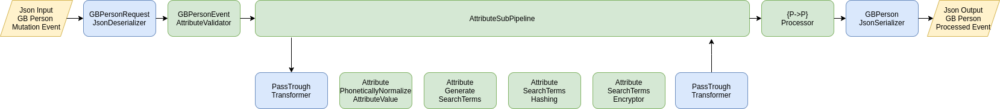

# LGS Person-Data-Processor

The person data processor is part of the Search-Index-Client for the project **Landesweite
Grundstücksuche (LGS)**.

The search-index-client offers different integration scenarios:

1. Integration over the rest interface of the search-index-client-service (with integrated
   person-data-processor).
2. Direct integration of the person-data-processor java library into an existing application.

This documentation explains the direct integration of the person-data-processor library.

## System Architecture

### Pipeline Concept

The person data processor library is implemented as an extendable pipeline of processors. The
pipeline can easily be extended with additional processors if required:


The pipeline starts with a transformer which converts the input data into the data format consumed
by the processors, and ends with a tail transformer which converts the processor format into the
required output format.

### Full PersonDataProcessor pipeline

Visualization of the fully assembled pipeline:



### Pipeline Payload Structure

The main payload is of type GBPersonEvent:


Each GBPersonEvent contains [0..n] attributes (e.g Name, Vorname, Jahr). During the processing the
pipeline will generate [1..n] hashed and encrypted search terms for each attribute (depending on the
attribute type).

## Getting Started

### Including the maven dependency

The library is provided through the github maven repository. Include the following dependency
section in your pom file:

```xml
<repositories>
   <repository>
      <id>github</id>
      <name>GitHub LGS Apache Maven Packages</name>
      <url>https://maven.pkg.github.com/ch-bj/lgs-person-data-processor</url>
   </repository>
</repositories>

<dependency>
  <groupId>ch.ejpd.lgs</groupId>
  <artifactId>person-data-processor</artifactId>
  <version>2.0.3</version>
</dependency>
```

### Pipeline creation and usage

The following code snippets show how to create a functional LGS pipeline.

#### Handler Configuration

The required parameters for the handlers (transformers, processors) are supplied by
the `HandlerConfiguration`. The following code snipped shows the configuration required for the full
LWGS-pipeline:

###### Message Digest

The attribute search terms are hashed, to prevent extraction of person data. Currently `SHA-512` is
defined as message digest for all delivering applications. The message digest will be defined by the
LGS operations team for all clients, since it needs to be consistent between the
search-index-client and the LGS search-index.

More information on supported message digests can be found in
section [AttributeSearchTermsHashing](#attributesearchtermshashing).

```java
private static final String MESSAGE_DIGEST = "SHA-512";
```

###### Cipher

After the attribute search terms where hashed, the search terms will additionally be encrypted to
prevent a dictionary attack on the hashes. The public key required for encryption, as well as the
cipher specification, will be provided by the LGS operations team. The currently defined cipher
specification is `RSA/ECB/PKCS1Padding`.

More information on supported cipher specification and creation of private & public keys for testing
can be found in section [AttributeSearchTermsEncryptor](#attributesearchtermsencryptor).

```java
private static final String CIPHER_SPECIFICATION="RSA/ECB/PKCS1Padding";
private static final String PUBLIC_KEY="MIIBIjANBgkqhkiG9....";
```

> This is not used at the moment.

###### Attribute Processing Specifications

The person-data-processor library supports a configuration driven approach to define processing
specifications for attributes. This approach allows to simply add new attributes, or to change
processing specifications for existing attributes by supplying a new specification file.

The valid specifications are packaged with the jar library and can be found in
the `src/main/resources` folder. Load them from the classpath with a suitable resource loader.

- [SupportedAttributes.json](src/main/resources/SupportedAttributes.json) contains the attributes
  specification.
- [SupportedAttributesSchema.json](src/main/resources/schemas/SupportedAttributesSchema.json)
  contains the json schema validator scheme for `SupportedAttributes.json`.

Provide both files as java Strings containing the json data:

```java
private final String SUPPORTED_ATTRIBUTES_SCHEMA_JSON=""; // Load content of SupportedAttributesSchema.json
private final String SUPPORTED_ATTRIBUTES_JSON=""; // Load content SupportesAttributes.json
```

###### Create HandlerConfiguration

Finally, create the `HandlerConfiguration` object:

```java
HandlerConfiguration handlerConfiguration = 
    HandlerConfiguration.builder()
        .handlerConfigurationItem(LWGSPersonDataProcessorParameters.PARAM_KEY_SUPPORTED_ATTRIBUTES,
            SupportedAttributes.fromJson(SUPPORTED_ATTRIBUTES_SCHEMA_JSON, SUPPORTED_ATTRIBUTES_JSON))
        .handlerConfigurationItem(LWGSPersonDataProcessorParameters.PARAM_KEY_PUBLIC_KEY, PUBLIC_KEY)
        .handlerConfigurationItem(LWGSPersonDataProcessorParameters.PARAM_KEY_CIPHER, CIPHER_SPECIFICATION)
        .handlerConfigurationItem(LWGSPersonDataProcessorParameters.PARAM_KEY_MESSAGE_DIGEST, MESSAGE_DIGEST)
        .build();
```

### Building of the Attribute Pipeline

```java
PipeLine<Attribute, Attribute, Attribute> attributePipeline = 
    PipeLine.builder(handlerConfiguration, Attribute.class, Attribute.class, Attribute.class)
        .addHeadTransformer(PassTroughTransformer.<Attribute>builder().build())
        .addStep(AttributePhoneticallyNormalizeAttributeValue.builder().build())
        .addStep(AttributeGenerateSearchTerms.builder().build())
        .addStep(AttributeSearchTermsHashing.builder().build())
        .addStep(AttributeSearchTermsEncryptor.builder().build())
        .addTailTransformer(PassTroughTransformer.<Attribute>builder().build())
        .build()
```

### Building of the GBPersonEvent Pipeline

```java
PipeLine<String, GBPersonEvent, String> gbPersonEventPipeline = 
    PipeLine.builder(handlerConfiguration, String.class, GBPersonEvent.class, String.class)
        .addHeadTransformer(GBPersonRequestJsonDeserializer.builder().build())
        .addStep(GBPersonEventAttributeValidator.builder().build())
        .addStep(AttributeSubPipeline.builder().attributePipeLine(attributePipeline).build())
        .addTailTransformer(GBPersonJsonSerializer.builder().build())
        .build();
```

A fully working minimal implementation can be found in
section [Working Minimal Implementation](#working-minimal-implementation).

## Components Description

### Transformers

#### PassTroughTransformer

Dummy transformer that does no conversion and just returns input object.

#### GBPersonRequestJsonDeserializer

Converts json file following the gb person event input format to a GBPersonEvent object.

#### GBPersonJsonSerializer

Converts a GBPersonEvent object into a gb person event output format.

### Processors

#### GBPersonEventAttributeValidator

Validates attributes in GBPersonEvent according to the definitions in SupportedAttributes.json. The
attribute validation is controlled be the definitions in
the [SupportedAttributes.json](#supportedattributesjson).

#### AttributeSubPipeline

Runs the attribute sub-pipeline on each attribute contained in the GBPersonEvent.

#### AttributePhoneticallyNormalizeAttributeValue

Does the phonetic normalization on attribute values, according to Normalization Form D (NFD) as
defined in the [Unicode® Standard Annex #15](https://www.unicode.org/reports/tr15/).

This processor is controlled by the *processingFlag* `PHONETICALLY_NORMALIZED` in
the [SupportedAttributes.json](#supportedattributesjson) file.

#### AttributeGenerateSearchTerms

Creates search terms from the source value. This processor is controlled by the
processingFlag `EDITING_DISTANCE` in the [SupportedAttributes.json](#supportedattributesjson)
file. If the flag is present for the processed attribute, the processor will apply the editing
distance algorithm, otherwise it will just create one searchTerms, equal to the source value.

The editing distance algorithm will produce ```2n+1; n=length of attribute value``` search terms.
For the value `bird` it would create the following terms:

```
    *bird, *ird, b*ird, b*rd, bi*rd, bi*d, bir*d, bir*, bird*
```

#### AttributeSearchTermsHashing

Hashes the search term with the specified message digest. The processor is controlled by the
processingFlag `HASHED` in the [SupportedAttributes.json](#supportedattributesjson)
file.

##### Required Parameters

`PARAM_MESSAGE_DIGEST`: Any supported message digest according to
the [MessageDigest](https://docs.oracle.com/javase/8/docs/api/java/security/MessageDigest.html)
specification.

#### AttributeSearchTermsEncryptor

Encrypts the search terms with the specified cypher. The processor is controlled by the
processingFlag `ENCRYPTED` in the [SupportedAttributes.json](#supportedattributesjson)
file.

##### Required Parameters

`PARAM_KEY_CIPHER`: Any supported cipher according to
the  [Cipher](https://docs.oracle.com/javase/8/docs/api/javax/crypto/Cipher.html)
specification.

##### Key Format Specification

The PersonDataProcessor will require an RSA key. The currently defined key size for productive usage
is 2048, but the person-data-processer is able to use any RSA key size.

- A public key in X.509 PEM format for the encryption (delivery pipeline).
- A private key in PKCS#8 PEM format for the decryption (receiving pipeline, or for testing
  purposes).

##### Key Generation Instructions (for testing purposes)

```
openssl genrsa -out private.pem 2048 openssl rsa -in private.pem -outform PEM -pubout -out
public_key.pem openssl pkcs8 -topk8 -inform PEM -outform PEM -nocrypt -in private.pem -out
private_key.pem
```

## Configuration files

### SupportedAttributesJson

The SupportedAttributes.json file defines the attribute types that will be accepted by the
processor. Currently valid
specification: [SupportedAttributes.json](src/main/resources/SupportedAttributes.json)

#### File Structure

Example snippets of the SupportedAttributes.json:

```json
{ 
... 
    {
        "attributeName": "vorname",
        "attributeType": "String",
        "processingFlags": ["PHONETICALLY_NORMALIZED", "EDITING_DISTANCE","HASHED","ENCRYPTED"],
        "mergeWith": "name",
        "required": true 
    } 
... 
    {
        "attributeName": "gemeinschaftArt",
        "validMembers": ["EinfacheGesellschaft", "Guetergemeinschaft", "Erbengemeinschaft", "Gemeinderschaft"],
        "attributeType": "Enum",
        "processingFlags": ["HASHED","ENCRYPTED"],
        "required": false
    } 
... 
}
```

#### Attribute Properties

<dl>
    <dt><strong>attributeName (String)</strong></dt>
    <dd>Unique attribute schema identifier</dd>
    <dt><strong>attributeType (String)</strong></dt>
    <dd>Required attribute value type (currently only string)</dd>
    <dt><strong>processingFlags ["NONE", "HASHED", "ENCRYPTED", "PHONETICALLY_NORMALIZED", "EDITING_DISTANCE"]</strong></dt>
    <dd>Controls which processing steps must be applied to attributes.</dd>
    <dt><strong>required [true, false]</strong></dt>
    <dd>Required attributes will trigger an RequiredAttributesMissingProcessorEvent if the attribute is missing</dd>
    <dt><strong>mergeWith (String)</strong></dt>
    <dd>Attributes will be merged (concatenated) with another attribute before further processing happens</dd>
    <dt><strong>validMembers (List of strings)</strong></dt>
    <dd>An Attributes with validMembers defined, will only accept attribute values from this list</dd>
</dl>

## Working Minimal Implementation

```java
package ch.ejpd.lgs.persondataprocessor;

import static ch.ejpd.lgs.persondataprocessor.configuration.LWGSPersonDataProcessorParameters.PARAM_KEY_CIPHER;
import static ch.ejpd.lgs.persondataprocessor.configuration.LWGSPersonDataProcessorParameters.PARAM_KEY_MESSAGE_DIGEST;
import static ch.ejpd.lgs.persondataprocessor.configuration.LWGSPersonDataProcessorParameters.PARAM_KEY_PUBLIC_KEY;
import static ch.ejpd.lgs.persondataprocessor.configuration.LWGSPersonDataProcessorParameters.PARAM_KEY_SUPPORTED_ATTRIBUTES;

import java.io.IOException;
import java.nio.file.Files;
import java.nio.file.Path;
import java.nio.file.Paths;
import java.security.KeyPair;
import java.security.NoSuchAlgorithmException;
import java.util.UUID;

import org.datarocks.banzai.configuration.HandlerConfiguration;
import org.datarocks.banzai.event.ProcessorEvent;
import org.datarocks.banzai.event.ProcessorEventListener;
import org.datarocks.banzai.pipeline.PipeLine;
import org.datarocks.banzai.transformer.PassTroughTransformer;
import ch.ejpd.lgs.persondataprocessor.configuration.model.SupportedAttributes;
import ch.ejpd.lgs.persondataprocessor.model.Attribute;
import ch.ejpd.lgs.persondataprocessor.model.GBPersonEvent;
import ch.ejpd.lgs.persondataprocessor.processor.AttributeSubPipeline;
import ch.ejpd.lgs.persondataprocessor.processor.attributeprocessor.AttributeGenerateSearchTerms;
import ch.ejpd.lgs.persondataprocessor.processor.attributeprocessor.AttributePhoneticallyNormalizeAttributeValue;
import ch.ejpd.lgs.persondataprocessor.processor.attributeprocessor.AttributeSearchTermsEncryptor;
import ch.ejpd.lgs.persondataprocessor.processor.attributeprocessor.AttributeSearchTermsHashing;
import ch.ejpd.lgs.persondataprocessor.processor.gbpersonprocessor.GBPersonEventAttributeValidator;
import ch.ejpd.lgs.persondataprocessor.processor.stringprocessor.EncryptionDecryptionAndMessageDigestHelper;
import ch.ejpd.lgs.persondataprocessor.transformer.GBPersonJsonSerializer;
import ch.ejpd.lgs.persondataprocessor.transformer.GBPersonRequestJsonDeserializer;
import org.junit.jupiter.api.Test;

public class LgsExamplePipeline implements ProcessorEventListener {
    private static final String PUBLIC_KEY = "MIIBIjANBgkqhkiG9....";

    private static final String CIPHER_SPECIFICATION = "RSA/ECB/PKCS1Padding";
    private static final String MESSAGE_DIGEST = "SHA-512";

    private final PipeLine<String, GBPersonEvent, String> gbPersonEventPipeline;

    public LwgsExamplePipeline() throws IOException, NoSuchAlgorithmException {
        gbPersonEventPipeline = gbPersonEventPipeline();
    }

    public static String readSupportedAttributes() throws IOException {
        Path path = Paths.get("src", "main", "resources", "SupportedAttributes.json");
        return new String(Files.readAllBytes(path));
    }

    public static String readSupportedAttributesScheme() throws IOException {
        Path path = Paths.get("src", "main", "resources", "schemas", "SupportedAttributesSchema.json");
        return new String(Files.readAllBytes(path));
    }

    private static HandlerConfiguration handlerConfiguration()
            throws IOException, NoSuchAlgorithmException {
        KeyPair keyPair = EncryptionDecryptionAndMessageDigestHelper.generateKeyPair("RSA", 2048);

        return HandlerConfiguration.builder()
                .handlerConfigurationItem(PARAM_KEY_SUPPORTED_ATTRIBUTES,
                        SupportedAttributes.fromJson(
                                readSupportedAttributesScheme(), readSupportedAttributes()))
                .handlerConfigurationItem(
                        PARAM_KEY_PUBLIC_KEY,
                        EncryptionDecryptionAndMessageDigestHelper.encodeBase64(
                                keyPair.getPublic().getEncoded()))
                .handlerConfigurationItem(PARAM_KEY_CIPHER, CIPHER_SPECIFICATION)
                .handlerConfigurationItem(PARAM_KEY_MESSAGE_DIGEST, MESSAGE_DIGEST)
                .build();
    }

    private PipeLine<Attribute, Attribute, Attribute> attributePipeline()
            throws IOException, NoSuchAlgorithmException {
        return PipeLine.builder(
                        handlerConfiguration(), Attribute.class, Attribute.class, Attribute.class)
                .addHeadTransformer(PassTroughTransformer.<Attribute>builder().build())
                .addStep(AttributePhoneticallyNormalizeAttributeValue.builder().build())
                .addStep(AttributeGenerateSearchTerms.builder().build())
                .addStep(AttributeSearchTermsHashing.builder().build())
                .addStep(AttributeSearchTermsEncryptor.builder().build())
                .addTailTransformer(PassTroughTransformer.<Attribute>builder().build())
                .build();
    }

    private PipeLine<String, GBPersonEvent, String> gbPersonEventPipeline()
            throws IOException, NoSuchAlgorithmException {
        return PipeLine.builder(handlerConfiguration(), String.class, GBPersonEvent.class, String.class)
                .addHeadTransformer(GBPersonRequestJsonDeserializer.builder().build())
                .addStep(GBPersonEventAttributeValidator.builder().processorEventListener(this).build())
                .addStep(AttributeSubPipeline.builder().attributePipeLine(attributePipeline()).build())
                .addTailTransformer(GBPersonJsonSerializer.builder().build())
                .build();
    }

    @Override
    public void processorEvent(ProcessorEvent processorEvent) {
        // This listener will be called on events (normally errors or warnings) occurring during
        // processing of the pipeline
        System.out.println("ProcessorEvent: " + processorEvent.getMessage());
    }

    public String processData(String inputGBPersonData) {
        final String correlationId = UUID.randomUUID().toString();
        return gbPersonEventPipeline.process(correlationId, inputGBPersonData);
    }
}
```

And it's usage
```java
  String processedData = pipeline.processData(
    "{\"metaData\":{\"personType\":\"NATUERLICHE_PERSON\",\"eventType\":\"INSERT\", \"EGBPID\":\"CH000000000000\"},\"natuerlichePerson\":{\"egpId\":\"123\",\"name\":\"Smith\",\"vorname\":\"John\",\"jahrgang\":\"1970\"}}");
```
